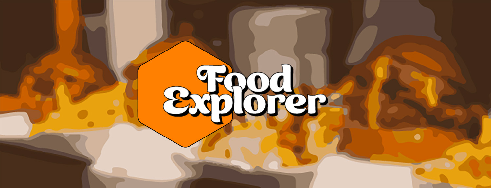

<div>
  
  
  <h1>🍔 Front End - Food Explorer</h1>

  <p style="max-width: 460px;">O <b>Food Explorer</b> é uma plataforma que, além de gerenciar pratos, oferece uma excelente experiência para o cliente, propondo um design de fácil entendimento, intuitivo e com várias funcionalidades.</p>

  <a href="https://foodexplorerdiogo.vercel.app/" target="_blank"></a>
  
</div>

## 📖 Tabela de Conteudos
  <ul>
    <li><a href="#-demonstração">🚀 Demonstração</a></li>
    <li><a href="#-pré-requisitos">📃 Pré-requisitos</a></li>
    <li><a href="#-tecnologias-utilizadas">💻 Tecnologias utilizadas</a></li>
    <li><a href="#%EF%B8%8F-instalação">🛠️ Instalação</a></li>
    <li><a href="#%EF%B8%8F-estrutura-de-pastas">🏗️ Estrutura de Pastas</a></li>
    <li><a href="#-autor">👨🏻‍💻 Autor</a></li>
    <li><a href="#-licença">📄 Licença</a></li>
  </ul>

## 🚀 Demonstração

  <h3>Conta de demonstração:</h3>

  ```bash
  {
    Endereço de e-mail: admin@foodexplorer.com
    Senha: Admin123!
  }
  ```

  <h3>Plataforma:</h3>
  <a href="https://foodexplorerdiogo.vercel.app/" target="_blank"></a>
  
  
## 📃 Pré-requisitos
<p>Antes de começar, você vai precisar ter instalado em sua máquina as seguintes ferramentas:</p>
<a href="https://nodejs.org/en/download"></a>
<p><b>Versão: v18.0.0+</b></p>
<a href=""></a>
<p><b>Versão: v8.0.0+</b></p>

## 💻 Tecnologias utilizadas
<div>
  <p><a href="https://developer.mozilla.org/pt-BR/docs/Web/JavaScript"></a></p>
  <p><a href="https://react.dev/"></a></p>
  <p><a href="https://tailwindcss.com/"></a></p>
  <p><a href="https://www.radix-ui.com/"></a></p>
  <p><a href="https://axios-http.com/ptbr/"></a></p>
  <p><a href="https://reactrouter.com/en/main"></a></p>
  <p><a href="https://www.framer.com/"></a></p>
  <p><a href="https://swr.vercel.app/"></a></p>
  <p><a href="https://vitejs.dev/"></a></p>
</div>

## 🛠️ Instalação
### 1️⃣ Clone o repositório:
Primeiro, clone o repositório do projeto para o seu ambiente local utilizando o Git:

```bash
git clone https://github.com/diogo-kappaun/food-explorer-web
```
### 2️⃣ Vá até o repositório clonado:
Após clonar o repositório, navegue até o diretório do projeto:
```bash
cd food-explorer-web
```
### 3️⃣ Instale as dependências:
Instale todas as dependências necessárias para executar o projeto. Isso inclui o React, SWR, Axios, e outras bibliotecas mencionadas no package.json:
```bash
npm install
```
### 4️⃣ Configurar Variáveis de Ambiente:
Vá até o arquivo .env.example na raiz do projeto, renomeie para .env e altere o valor conforme necessário. (Caso a porta não seja definida, o padrão será porta 10000 para o localhost)
```bash
VITE_API_URL='https://api.com'
```
### 5️⃣ Execute a aplicação:
Abra o terminal e inicie o aplicativo da seguinte forma:
```bash
npm run dev
```
## 🏗️ Estrutura de Pastas
Abaixo está a estrutura principal do projeto:
```bash
food-explorer-web
├── node_modules                # Dependências instaladas pelo npm/yarn
├── public
│  └── logo.svg                 # Logotipo
├── src
│  ├── assets                   # Recursos estáticos (imagens)
│  ├── components               # Componentes React reutilizáveis
│  ├── hooks                    # Hooks customizados
│  ├── pages                    # Páginas principais da aplicação
│  ├── routes                   # Configuração das rotas da aplicação
│  ├── services                 # Serviços como APIs
│  ├── utils                    # Funções utilitárias e helpers
│  ├── main.jsx                 # Arquivo principal do React
│  └── global.css               # Estilos globais da aplicação
├── index.html                  # Template HTML principal
├── postcss.config.js           # Configuração do PostCSS
├── tailwind.config.js          # Configuração do Tailwind CSS
└── vite.config.js              # Configuração do Vite
```

## 👨🏻‍💻 Autor

<a href="https://github.com/diogo-kappaun">
 
 <br />
 <sub><b>Diogo H. Kappaun</b></sub>
</a>


Feito com ❤️ por Diogo H. Kappaun 👋🏽 Entre em contato!

[](https://www.instagram.com/eu.diogokappaun/) [](https://www.linkedin.com/in/diogo-kappaun-2070b2265/) 
[](mailto:diogohkappaun@gmail.com)

## 📄 Licença

Este projeto é licenciado sob os termos da Licença MIT. A Licença MIT é uma licença de código aberto que permite o uso, modificação, distribuição e venda do software, sujeito a certas condições. Consulte o arquivo <b><a href="https://github.com/diogo-kappaun/food-explorer-web/blob/main/LICENSE">LICENSE</a></b> para mais detalhes.
